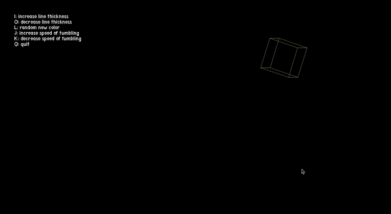

# Bouncing Tumbling Cube

## Overview
This repo is a place where I organize my toy projects I've made to practice C. The main program in here right now is a simple program that uses the SDL2 library to render a 3D cube that bounces and tumbles around the screen. This project is purely for fun and to get some more practice with C.



## How the Cube Works
The program initializes an SDL window and renderer, then enters a game loop where it handles user input, updates the cube's rotation and position, and renders the cube frame by frame. Each frame, the program rotates the cube's vertices around the X and Y axes, projects these 3D coordinates to 2D screen space, and then draws lines between the projected points to render the cube.
The fun of this project for me is adding little features that allow you to interact with the cube. Right now you can do basic things like change the color and thickness of the lines that make up the cube. I'm working on adding more fun little ways to interact with the cube, like being able to grab it and throw it around, or speed up or slow down the tumbling, and change the distance between vertices to make the cube bigger or smaller. Exciting stuff.

## Dependencies
- SDL2: For creating the window, handling events, and rendering.
- SDL_ttf: For rendering text on the screen.

## Building and Running
To build and run this project, you need to have SDL2 and SDL_ttf installed on your system. Once installed, you can compile the program using a C compiler like gcc, linking against the SDL2 and SDL_ttf libraries. For example:

```bash
gcc main.c -o BouncingCube -lSDL2 -lSDL2_ttf
./BouncingCube
```